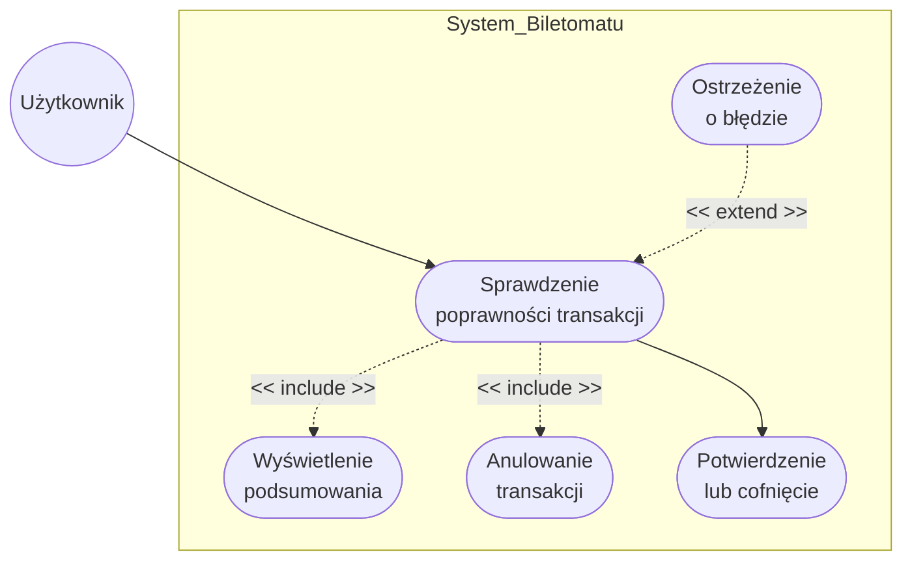

```mermaid
graph TD
    %% Aktor
    User((Użytkownik))

    %% System
    subgraph System_Biletomatu
        %% Używam <br/> aby złamać linię w środku owalu
        MainCheck(["Sprawdzenie<br/>poprawności transakcji"])
        ShowSummary(["Wyświetlenie<br/>podsumowania"])
        Cancel(["Anulowanie<br/>transakcji"])
        ErrorWarn(["Ostrzeżenie<br/>o błędzie"])
        Confirm(["Potwierdzenie<br/>lub cofnięcie"])
    end

    %% Relacje
    User --> MainCheck

    %% Include (przerywana linia z grotem)
    MainCheck -. << include >> .-> ShowSummary
    MainCheck -. << include >> .-> Cancel

    %% Extend (przerywana linia, grot w stronę rozszerzanego)
    ErrorWarn -. << extend >> .-> MainCheck

    %% Zwykła relacja
    MainCheck --> Confirm

```
