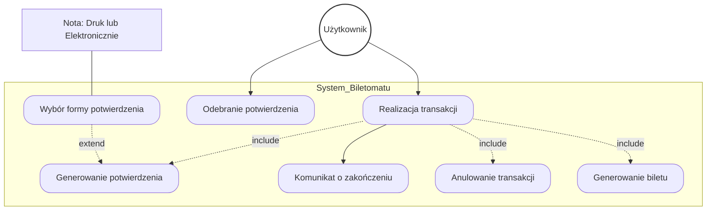

```mermaid
graph TD
    %% Aktor
    User((Użytkownik))

    %% System
    subgraph System_Biletomatu
        MainUC[Realizacja transakcji]
        GenConfirm[Generowanie potwierdzenia]
        Pickup[Odebranie potwierdzenia]
        EndMsg[Komunikat o zakończeniu]
        Cancel[Anulowanie transakcji]
        GenTicket[Generowanie biletu]
        ChooseForm[Wybór formy potwierdzenia]
    end

    %% Relacje
    User --> MainUC
    User --> Pickup

    %% Include i Extend (reprezentowane liniami przerywanymi)
    MainUC -. include .-> GenTicket
    MainUC -. include .-> Cancel
    ChooseForm -. extend .-> GenConfirm
    MainUC -. include .-> GenConfirm
    MainUC --> EndMsg

    %% Notatka jako węzeł
    Note[Nota: Druk lub Elektronicznie] --- ChooseForm

    %% Stylowanie, aby przypominało Use Case (opcjonalne)
    style User fill:#fff,stroke:#333,stroke-width:2px
    style MainUC rx:20,ry:20
    style GenConfirm rx:20,ry:20
    style Pickup rx:20,ry:20
    style EndMsg rx:20,ry:20
    style Cancel rx:20,ry:20
    style GenTicket rx:20,ry:20
    style ChooseForm rx:20,ry:20
```
