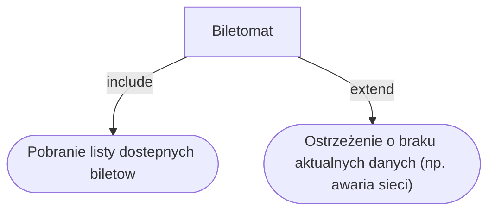
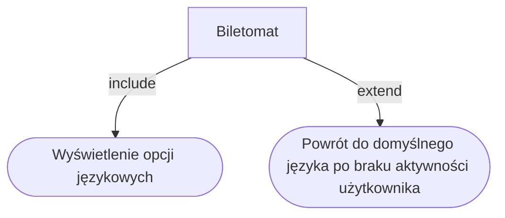
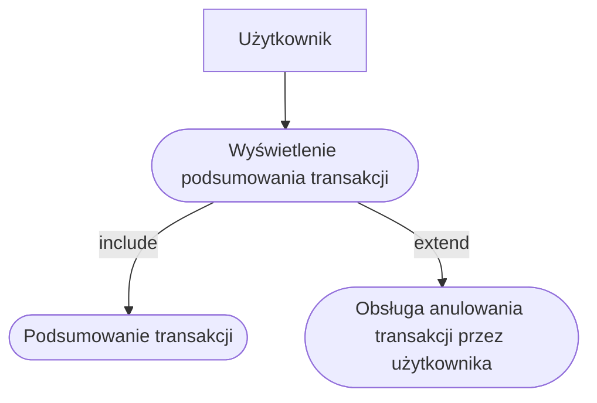
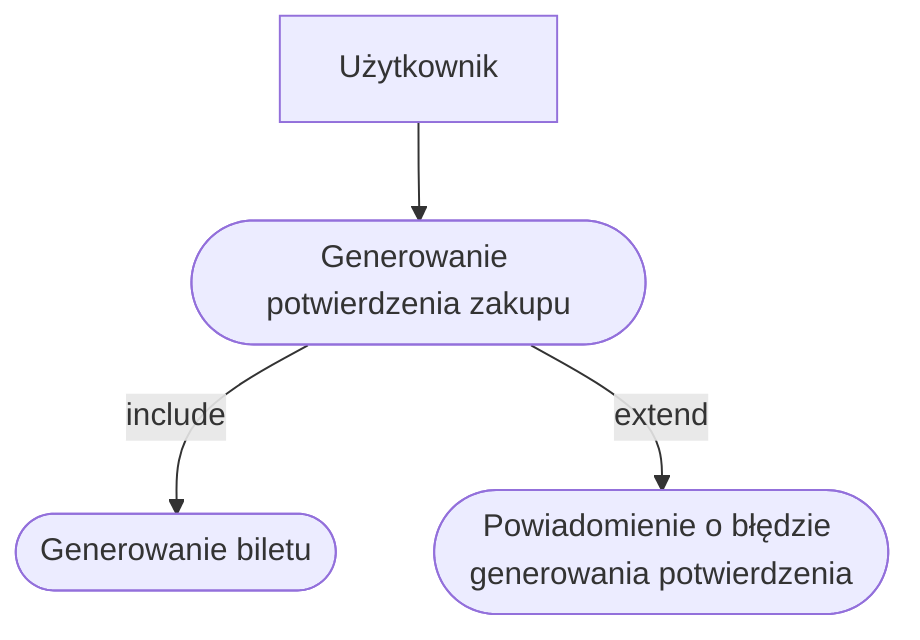

# Diagram przypadkow uzycia

## Wyswietlenie dostepnych biletow

```mermaid

flowchart TB

   n1["Biletomat"] -- include --> n2(["Pobranie listy dostepnych biletow"])

   n1 -->|extend| n3(["Ostrzeżenie o braku aktualnych danych (np. awaria sieci)"])


   n1@{ shape: rect}

```

## Obsluga wyboru jezyka

```mermaid

flowchart TB

   n1["Biletomat"] -- include --> n2(["Wyświetlenie opcji językowych"])

   n1 --extend--> n3(["Powrót do domyślnego języka po braku aktywności użytkownika"])

```

##  Wyświetlenie podsumowania transakcji

```mermaid

flowchart TB
    n1["Użytkownik"] --> n2(["Wyświetlenie podsumowania transakcji"])
    n2 -- include --> n3(["Podsumowanie transakcji"])
    n2 -- extend --> n5(["Obsługa anulowania transakcji przez użytkownika"])
    n1@{ shape: rect}

```

##  Generowanie potwierdzenia zakupu

```mermaid

flowchart TB
    n1["Użytkownik"] --> n2(["Generowanie potwierdzenia zakupu"])
    n2 -- include --> n3(["Generowanie biletu"])
    n2 -- extend --> n5(["Powiadomienie o błędzie generowania potwierdzenia"])
    n1@{ shape: rect}

```

