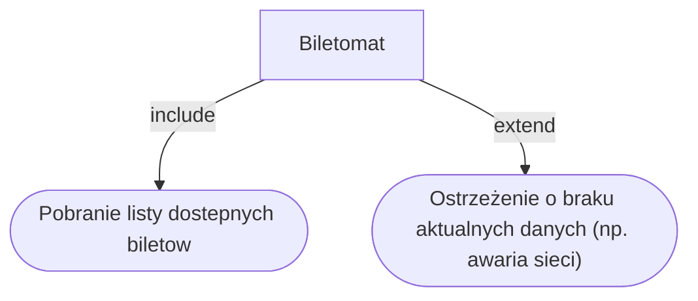
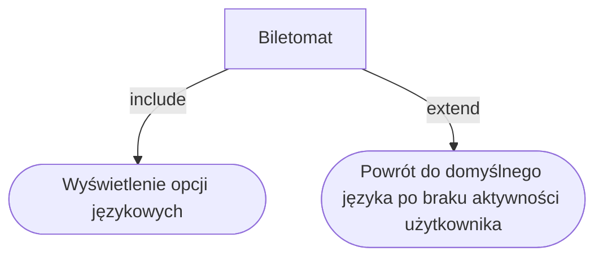

# Diagram przypadkow uzycia

## Wyswietlenie dostepnych biletow

```mermaid

flowchart TB

   n1["Biletomat"] -- include --> n2(["Pobranie listy dostepnych biletow"])

   n1 -->|extend| n3(["Ostrzeżenie o braku aktualnych danych (np. awaria sieci)"])


   n1@{ shape: rect}

```

## Obsluga wyboru jezyka

```mermaid

flowchart TB

   n1["Biletomat"] -- include --> n2(["Wyświetlenie opcji językowych"])

   n1 --extend--> n3(["Powrót do domyślnego języka po braku aktywności użytkownika"])

```

