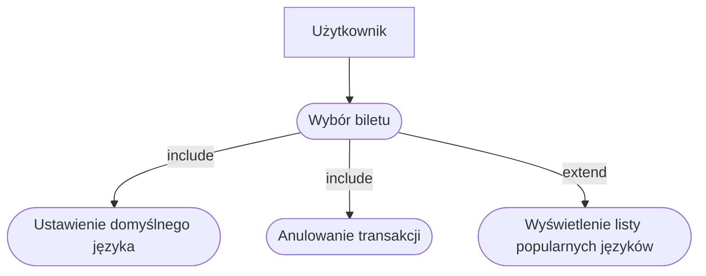

#Diagram przypadków użycia

##Wybor jezyka

```mermaid
flowchart TB
   n1["Użytkownik"] --> n2(["Wybór biletu"])
   n2 -- include --> n3(["Ustawienie domyślnego języka"]) & n4(["Anulowanie transakcji"])
   n2 --extend--> n5(["Wyświetlenie listy popularnych języków"])
   n1@{ shape: rect}
```
###Szybki wybor rodzaju biletow

```mermaid	
flowchart TB
    n1["Użytkownik"] --> n2(["Szybki wybór rodzaju biletu"])
    n2 -- include --> n3(["Weryfikacja dostępnych biletów"]) & n4(["Anulowanie transakcji"])
    n2 -->|extend| n5(["Wyświetlenie podpowiedzi (jeśli użytkownik nie wybiera przez określony
czas)"])
    n1@{ shape: rect}
```

