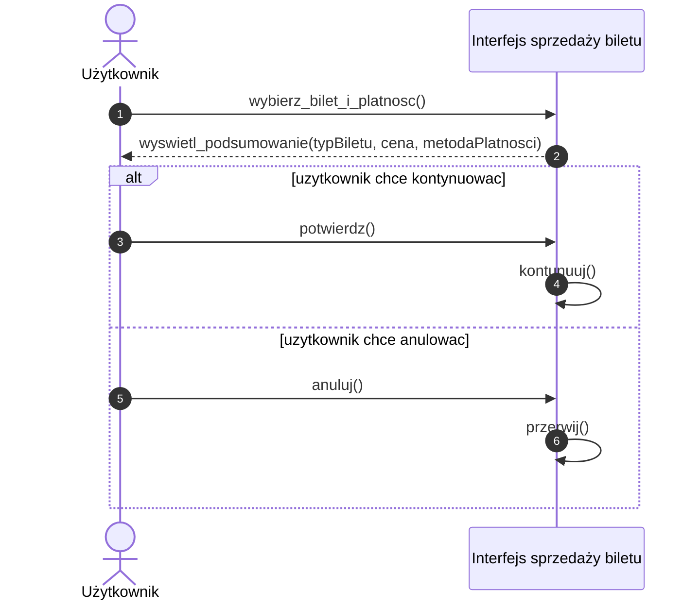

# Diagram przypadków użycia

## Wybor jezyka

### Szybki wybor rodzaju biletow

### Sprawdzenie poprawności transakcji

### Otrzymanie potwierdzenia zakupu

# Diagramy sekwencji
## Sprawdzenie poprawności transakcji

