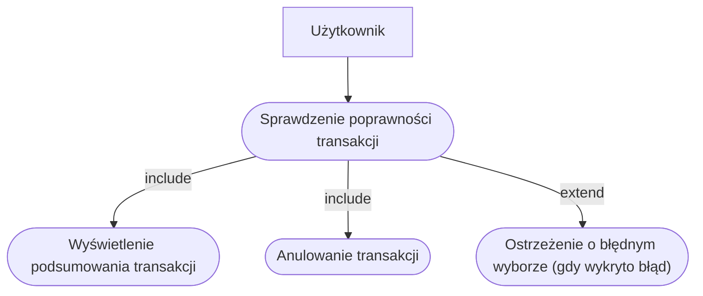
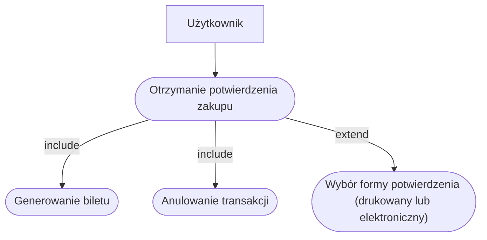
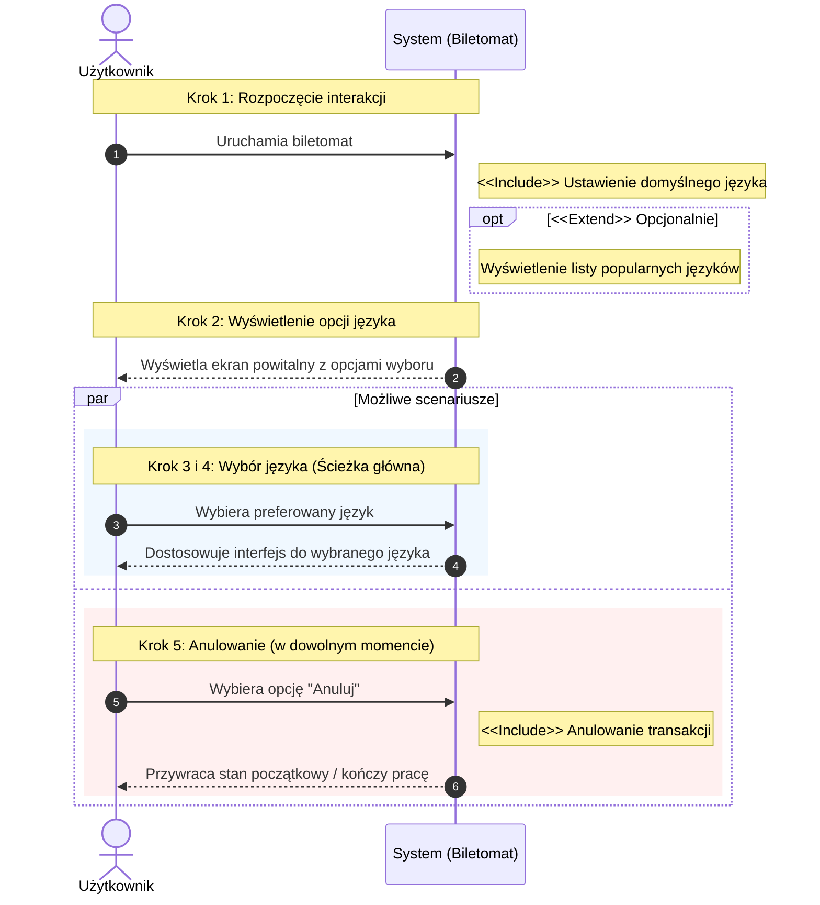

# Diagram przypadków użycia

## Wybor jezyka

### Szybki wybor rodzaju biletow

### Sprawdzenie poprawności transakcji

### Sprawdzenie poprawności transakcji

### Diagramy Sekwencji
### Wybor jezyka

