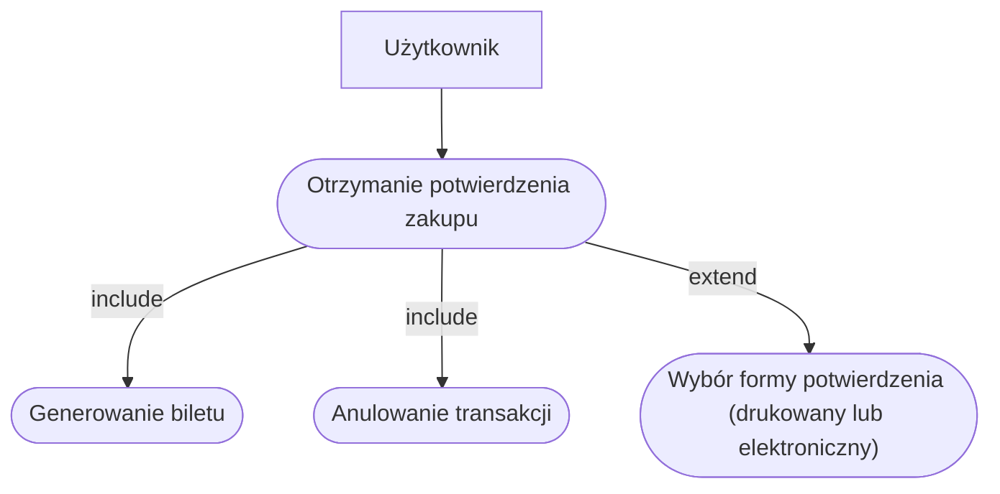

# Diagram przypadków użycia

## Wybor jezyka


### Szybki wybor rodzaju biletow


### Sprawdzenie poprawności transakcji


### Sprawdzenie poprawności transakcji


### Diagramy Sekwencji
### Wybor jezyka


### Szybki wybor rodzaju biletow


## Sprawdzenie poprawności transakcji

## Otrzymanie potwierdzenia zakupu

### Diagramy Klas
## Otrzymanie potwierdzenia zakupu

## Sprawdzenie poprawności transakcji
```mermaid
classDiagram
    %% Główny kontroler interakcji
    class InterfejsSprzedazy {
        -Transakcja aktualnaTransakcja
        
        %% Metody wywoływane przez Użytkownika (Publiczne)
        +wybierz_bilet_i_platnosc(typ, metoda)
        +potwierdz()
        +anuluj()
        
        %% Metody wewnętrzne / Wyjście do Użytkownika (Prywatne/Protected)
        -wyswietl_podsumowanie()
        -przetworz_transakcje()
        -przerwij_sesje()
    }

    %% Klasa reprezentująca dane, które pojawiły się w parametrach
    class Transakcja {
        +String typBiletu
        +double cena
        +String metodaPlatnosci
        +StatusTransakcji status
    }

    %% Opcjonalnie: Typ wyliczeniowy dla statusu (dla precyzji)
    class StatusTransakcji {
        <<enumeration>>
        OCZEKUJE
        ZATWIERDZONA
        ANULOWANA
    }

    %% Relacje
    InterfejsSprzedazy "1" *-- "0..1" Transakcja : zarządza
    Transakcja ..> StatusTransakcji : posiada

## Wizualizacja diagramu klas
```mermaid
classDiagram
    class Użytkownik{
        - String username
        + void uruchomBiletomat()
        + void wybierzPreferowanyJezyk()
        + void wybierzOpcjeAnuluj()
    }

    class Biletomat{
        - String wybranyJezyk
        - String idSesji
        - void ustawienieDomyslnegoJezyka()
        + void wyswietlEkranPowitalnyZOpcjami()
        + void dostosujInterfejsDoJezyka(wybranyJezyk: String)
        - void uruchomProcedureAnulowania()
    }
    class Server{
        - List listaPopularnychJezykow
        + List pobierzListePopularnychJezykow()
    }

    Biletomat-->Server:pobieraDane
    Użytkownik-->Biletomat:ustawiaJezyk

```
