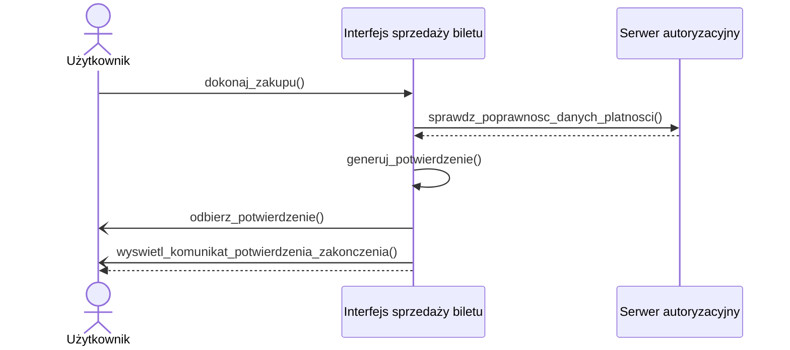

# Diagram przypadków użycia

## Wybor jezyka


### Szybki wybor rodzaju biletow


### Sprawdzenie poprawności transakcji


### Sprawdzenie poprawności transakcji


### Diagramy Sekwencji
### Wybor jezyka


### Szybki wybor rodzaju biletow


## Sprawdzenie poprawności transakcji
```mermaid
actor A1 as Użytkownik
  participant P1 as Interfejs sprzedaży biletu
  autonumber
  A1->>P1: wybierz_bilet_i_platnosc()
  P1-->>A1: wyswietl_podsumowanie(typBiletu, cena, metodaPlatnosci)
  alt uzytkownik chce kontynuowac
    A1->>P1: potwierdz()
    P1->>P1: kontunuuj()
    else uzytkownik chce anulowac
    A1->>P1: anuluj()
    P1->>P1: przerwij()
```
## Otrzymanie potwierdzenia zakupu

